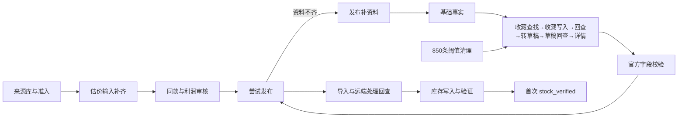
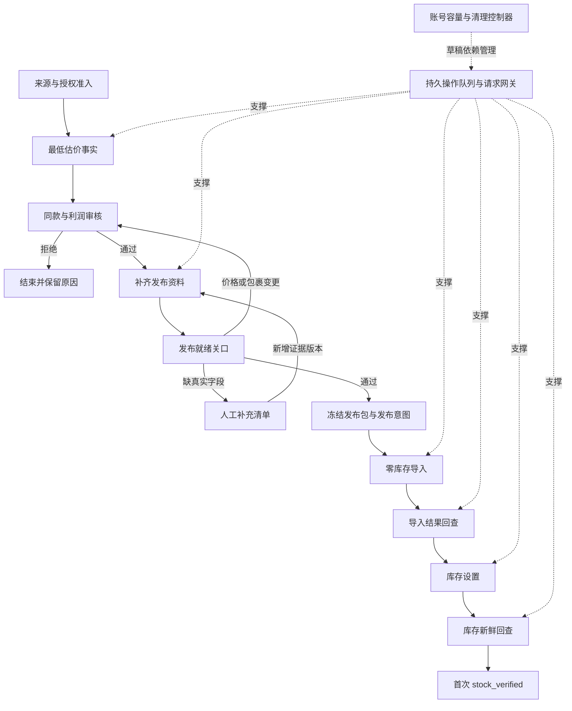

# FlowHub 完整上架链路分析与重设计

设计基线：2026-09-18 18:37，生产 af6d6f0，主控 91115。本文是下一版实施规格，尚未把新架构替换到生产。原有自动上架、监控与阈值清理继续按当前配置运行。

## 1. 结论与证据边界

主要瓶颈是“资料采集作为一个长任务，占用执行通道并在多个外部状态之间反复等待”。单纯增加并发或延长整段超时不能解决。上一轮拆分使估价与发布资料不再相互卡死，但只拆到了 facts/source/validate，source 内部仍是串行长流程；需要继续拆到单个外部操作，并统一请求预算、资料版本和状态所有权。

实测证据：`full-chain-redesign-evidence.json`；以下统计是同一次本地账本快照，不是远端全店可售性审计。

| 指标 | 18:37 实测 | 解释 |
|---|---:|---|
| 重构后观察时间 | 169.5 分钟 | 含部署停顿 |
| 首次 stock_verified | 23 条 | 约 8.1 条/小时的窗口平均，不能当未来承诺 |
| 最长无完成区间 | 36.7 分钟 | 包含窗口首尾 |
| 最近 15 / 30 / 60 分钟完成 | 5 / 9 / 12 条 | 最近回升，但整体尚不稳定 |
| 待补资料 | 57 条 | 不是所有任务都在运行 |
| 发布资料 source 阶段 | 37 条 | 29 网络类等待、2 缺资料等待、6 待调度 |
| 发布资料 validate 阶段 | 1 条运行 | 与 source 共用一个发布修复执行通道 |
| source→下一阶段成功事件 | 28 次，P50 91.5 秒，P95 114.1 秒 | 事件数，不是独立上架数 |
| source 等待事件 | 368 次，P95 139.5 秒，最长157.9秒 | 包括很快返回的冷却等待，不能全算网络请求失败 |
| validate 通过事件 | 23 次，P50 27.3 秒 | 不等于23条已上架 |
| 共享 ERP 预约 | 最近5分钟116次，间隔2500毫秒 | 约120次/5分钟的配置容量；预约包含未来槽位/取消，不等于成功请求 |

需要纠正之前的诊断表述：代码把外层 TimeoutError 统一归为 network；它可能包含限速排队、多次请求累计、SQLite 等待和真正的网络超时。现在只能证明 source 阶段预算频繁耗尽，不能声称这些全部是网络连接故障。累计193次限流也是历史总数，不能归因到当前窗口。

## 2. 现有链路与耦合点

### 已证实的结构性问题

1. **外层分段、内层未分段。** `repair_source.supplement` 一次调用 `SourceCollector.collect`，涵盖汇率、收藏、容量、转草稿、详情等操作。每次桥接允许排队60秒、网络25秒；Python桥接95秒；外层source总预算120秒。多个正常请求累计也可能超过120秒。再次执行时虽然有写入日志保护，仍需重复部分查询。
2. **资料获取与最终校验争用同一个发布修复槽。** 校验已经有优先级，但只有source结束或超时才可切换；优先级不能打断已运行的长source任务。
3. **等待仍占住执行槽。** 每个SKU在协程内等待网络、限速、查询分页。其他SKU只能等待该次结束，没有“预约到期再派发”的操作队列。
4. **诊断精度不足。** publication-request桥接已有连接/限速/网络计时，source-detail桥接没有同等指标。取消时未必保留当前端点及已完成子步骤。不能据此选用正确恢复动作。
5. **传输分裂。** `MaoziPublisher.erp`直接HTTPX、每次新客户端、独立代理配置；source-detail每次新Node进程、native fetch、共享文件限速；发布使用常驻桥接池和StepTransport。回退、缓存、熔断和代理策略不一致，也不能保证所有ERP请求进入同一预算。
6. **多级回查反复消耗共享额度。** favorite按已导入/未导入分开查；draft恢复按账号完整列表查找。代码有完整性保护，必须保留，但不能让每个SKU独立扫描同一账号列表。缓存当前主要在进程内，重启后丢失。
7. **本地同步DB操作在异步热路径。** SQLite busy_timeout=10秒；`admit_one`虽移到线程，仍在BEGIN IMMEDIATE中扫描来源与写入；其他热路径也直接操作DB。实测超时超过120秒，不能直接证明全部来自DB，但代码具备阻塞事件循环的路径。
8. **发布过早成为资料探测入口。** 审核完成后进入发布，再因缺必填属性退回补资料。最终发布校验不能删除，但应在独立“发布就绪关口”先做完，发布只处理已具备发布条件的包。
9. **清理会影响采集依赖。** 清零后旧draft_id失效，当前逻辑以删除回执触发重取。若已有完整本地资料还重复依赖远端草稿，会制造不必要的重新采集。自动清理排空目前按全局租约计数，有被独立任务持续租约拖延的风险；这是代码风险，尚无本轮阈值触发失败实证。
10. **观测对象混合。** repair_workflows是阶段日志，plugin_pipeline是业务队列，source_details是来源写入账本，plugin_publications与production journal是发布记录；它们不能各自独立判定“成功”。历史ready也不能当当前就绪，需要按版本关联。

### 已有机制应保留

原SKU/offer所有权、原同款与利润审核、真实来源与字段时间、官方账户/仓库绑定、明确下架控制、零库存导入和库存回查、未知写入只回查、人工暂停、草稿删除前完整备份与删除回执。

当前Windows只承担已配置的rank/screen，不能因为心跳在线就把采集任务发过去；未实际上报的新版本仍是未知。独立在售同款审核继续运行，其任务与配额必须单独识别。

## 3. 目标架构：业务状态与外部操作分离

业务状态不直接执行整条采集链。状态机只决定下一条操作、校验操作回执并推进；一次执行器领取一个操作，完成即释放。远端等待通过due_at表达，不sleep占用SKU执行槽。业务不可能靠新建第二个发布账本获得重复发布资格。

### 3.1 责任边界

| 组件 | 唯一职责 | 禁止越界 |
|---|---|---|
| Admission | 来源/授权/队列预算检查，建立业务任务 | 不在写事务内查网络、扫描全库 |
| Facts | 最低估价事实、真实证据与新鲜度 | 不代替利润审核 |
| Review | 同款、供应商、利润决定及输入指纹 | 不导入、不设置库存 |
| Acquisition | 获取或复用来源资料，单操作恢复 | 不发布、不绑定别的店铺 |
| Dossier Gate | 官方schema、必填属性、字典值、来源一致性校验 | 不猜属性、不用默认值冒充事实 |
| Publication | 冻结包、原offer意图、导入及库存状态机 | 不采集补资料，不因超时换offer/后台 |
| Request Gateway | 连接复用、预算、预约、请求计时、错误类型 | 不自动重放业务写入 |
| Capacity | 每账号观察、预留、清理与远端确认 | 不删除在线商品/库存/收藏夹 |
| Monitor | 首次完成、各阶段等待和恢复证据 | 不以尝试/提交/校验数冒充上架 |

估价事实先做便宜、必需的部分；只有审核通过的商品进入完整资料采集，减少对最终会被拒绝商品的ERP消耗。若某类商品的估价本身需要资料，则获取对应最小字段子集，复用同一份证据，不创建第二次来源写入。

## 4. 收藏—草稿—详情：新的操作状态机

每个任务固定owner、ERP账号指纹、源SKU、源seller、资料generation。操作的slot、claim和epoch与真实业务身份分离。

| 操作 | 成功判据/下一步 | 不确定或失败处理 |
|---|---|---|
| InspectSnapshot | 精确身份匹配、所需字段齐全且各字段时效有效→资料关口 | 缺哪些字段只规划对应操作 |
| FindFavorite | 精确SKU唯一favorite_id；记录来源和查询完整性 | 无结果只有在有效、完整查询后才允许规划创建；多结果转冲突 |
| CreateFavorite | 先持久写意图，再派发一次 | 响应丢失→UNKNOWN→FindFavorite；禁止再次toggle |
| ConfirmFavorite | 精确身份与favorite_id确认 | 未显现→定时回查；到观察期限仍未知→人工异常，不推断没写入 |
| ReserveCapacity | 新鲜容量+本地预留允许本次转草稿 | 暂停该账号新增采集，其他回查继续 |
| ImportDraft | 固定favorite_id，持久写意图，派发一次 | 丢回执→UNKNOWN→FindDraft；禁止重复edit_import |
| FindDraft | 同账号完整索引、collect_from与goods_id精确匹配 | 结果不完整不能当不存在；多匹配不任意选一个 |
| ReadDraft | 指定draft_id读取并校验源SKU、单变体、字段来源 | 可重试读取；远端缺失与网络错误分开 |
| SaveSnapshot | 加密原始详情、标准化字段、内容hash和observed_at全部落盘 | DB失败只重试保存，不能回头再发远端写入 |
| ValidateDossier | 类目/类型/必填属性及字典值通过官方规则 | 缺字段清单转人工；服务暂不可用只等待依赖 |

每步单独落盘request_id、intent_id、attempt_id、started_at、dispatched_at、completed_at、result_ref。长分页每页保存cursor、total、generation、去重集合摘要；恢复时验证列表代际/总数一致，不拼接两个时间点的列表当完整证明。

**最重要的状态区分：**

- NOT_SENT：明确没派发，可按策略重新预约。
- DISPATCHING / DISPATCHED：已记录可能派发；崩溃后一律保守回查。
- ACKNOWLEDGED：服务器确认接收，进入观察；不代表商品已生成。
- UNKNOWN：写入结果未知，只回查原意图。请求超时不产生新写入权限。
- OBSERVED：按精确身份查到远端结果。
- VALIDATED：资料校验通过，仅表示资料就绪。
- MANUAL_REQUIRED：缺真实事实、身份歧义或长期未知，退出自动重试并提供操作说明。

不存在跨远端和本地的原子事务，不能承诺通用exactly-once。采用“持久意图、单次派发、保守未知、幂等回查”；远端若明确支持幂等键才使用，未经验证不假设支持。

## 5. 请求预算、超时与错误恢复

### 5.1 一个账号预算，多条业务队列

ERP与Ozon官方API各自独立调度。ERP所有客户端最终纳入同一协调器；迁移前保留现有全局pacing账本，不能新建平行预算把实际速率翻倍。预算键使用凭证指纹，日志不含token。

初始仍沿用2500毫秒预约间隔，不自动提速。只提高额度利用率：删除重复回查、合并同账号同代际查询、复用连接、取消无用预约。当前116次/5分钟是全体共享预约，不能全部分给上架。

队列按加权公平调度，并有最大饥饿时间：在售审核保留既有服务能力；本上架链路优先处理已派发写入回查和库存验证，其次是就绪商品发布、资料详情、其他采集和来源发现。具体配额先通过指标确认各业务占用后配置，不从独立审核抢额度。低优先级超过5分钟提升一档，但不能超出账号总预算。紧急容量阻塞可暂停新采集，清理也必须走同一预算。

连接池有界（初始每ERP账号最多2条实际网络请求并发）；池大小不等于允许速率。等待预约的操作不占网络连接、不占长SKU租约。没有把3台Windows上线等同于3倍ERP额度。

### 5.2 四类时间必须分别计量

`queue_wait_ms`（任务等待）、`rate_wait_ms`（限速预约）、`network_ms`（含连接、首字节、响应）、`db_wait_ms`（提交竞争）。另记event_loop_lag与cancel_settle_ms。每个TimeoutError必须指明在哪个阶段、哪个端点、是否已派发。

起始网络预算可沿用25秒；排队超过60秒应退回due_at，而不是保持协程。整体业务deadline只用来升级告警或人工处理，不能取消后把未知写入当成未发送。超时取消只是一项请求终止策略，不宣称120秒就是硬墙钟上限。

| 错误类别 | 自动处理 |
|---|---|
| RATE_DEFERRED / POOL_BUSY | 按预约时间再调度；不记为资料失败 |
| CONNECT/READ_TIMEOUT（读取） | 指数退避+抖动；同账号/端点熔断，单个探针恢复 |
| AUTH_EXPIRED | 暂停该凭证的新请求，明确提示修复登录/凭证 |
| WRITE_UNKNOWN | 回查原意图；禁止写入重试 |
| REMOTE_NOT_VISIBLE | 根据远端可见性窗口定时回查 |
| CAPACITY_FULL | 通知容量控制器；不继续创建草稿 |
| FIELD_MISSING / DICTIONARY_INVALID | 真实字段清单，转人工/重映射已有真实证据 |
| IDENTITY_CONFLICT | 冻结该任务，不跨SKU、seller、账号合并 |
| LOCAL_DB_BUSY | 只重试本地事务，保持外部回执，报警DB延迟 |
| CONTRACT_INVALID / PROGRAM_ERROR | 停对应适配器并告警，不伪装缺字段或网络 |

熔断与冷却必须持久化，重启不能清零导致一轮新的请求风暴。状态恢复需要成功探针，不仅等待时钟到期。对明确的永久缺失无需凑满3/6次重试。

## 6. 资料模型与发布就绪关口

采用版本化DossierSnapshot：source_identity、account_binding、raw_ref、content_hash、schema_version、每字段value/source/observed_at/valid_until、类目字典版本、校验结果。静态尺寸、真实属性与动态售价/运费/限制条件分开管理，沿用已批准的字段时效规则；不能把整个快照刷新时间当成所有字段刚被观察。

发布就绪关口检查：

1. 来源SKU/seller、变体、目标账户/仓库/路线一致；旧店铺enabled=0不自动等于授权失效，也不自动改绑新店铺。
2. 最新同款决定与来源/供应商身份指纹一致。
3. 利润决定使用的尺寸重量、采购价、售价、运费、物流与准备发布的包相符；有变化只触发受影响的重新审核。
4. 类目/类型、必填属性及字典ID有效且有真实来源；描述润色不能生成不存在的产品事实。
5. 写入授权、配额、下架禁用控制仍有效。
6. 冻结准备包hash、review_hash、profit_hash、store_binding、write_deadline，并生成原发布账本的唯一意图。

正式发布前仍执行最后的权限、新鲜度与指纹检查，防止检查后数据变化。已有未知导入/库存写入继续使用其冻结包，不能拿新资料另开一个发布意图。需修改时先完成原意图回查，再走有审计的变更流程。

## 7. 数据库与并发所有权

继续保留原业务账本，不立即迁移数据库平台。先缩短事务：候选扫描在只读连接有界分页，写事务内仅重新核验选定行和CAS提交；网络永不在DB写事务内。热路径DB调用进入受控线程/专用写入队列，线程等待不能阻塞事件循环。

建议新增的逻辑表（实施时按迁移脚本建表；不是让人工执行SQL）：

| 表 | 主键/重要字段 | 用途 |
|---|---|---|
| acquisition_tasks | task_id；unique(owner,account,sku,seller,generation)；stage,state,due_at,epoch,version | 来源资料总状态 |
| acquisition_operations | operation_id；unique(task_id,kind,generation)；intent_hash,dispatch_state,remote_id,result_ref | 单次外部操作及未知写入 |
| operation_attempts | attempt_id；operation_id,endpoint,timings,error_class,write_uncertainty | 读取重试、请求证据 |
| dossier_snapshots | snapshot_id；identity,content_hash,raw_ref,field_evidence,schema_version | 不可变资料包 |
| request_accounts | account,service,blocked_until,circuit_state,next_slot | 共享预算与恢复 |
| source_account_indexes | account,kind,generation,cursor,complete,observed_at | 收藏/草稿索引和完整性证明 |
| task_events | event_id,task_id,from,to,reason,at,input_version | 可回放状态变更 |

租约含worker_id、token、expiry、递增fencing epoch；结果只有epoch和输入版本仍一致才能推进。旧worker迟到的回执保留作证据，但不覆盖新状态。到期不自动允许重发未知写入。业务发布的SKU排他所有权保持原实现，新增采集表不能获得第二份发布资格。

状态只有一处权威：采集状态由acquisition_tasks维护；plugin_pipeline仅记录关联任务ID和业务投影。repair_workflows降为兼容投影。DB提交后通知丢失，通过事务内outbox/定时扫描恢复，不依赖纯内存回调。原plugin_publications、plugin-production.sqlite3及全局claims继续掌管发布，不新增与之竞争的发布队列。

## 8. 阈值清理纳入资料生命周期

保留用户明确要求：每60秒检查，85%（850/1000）触发，目标清到0。不是每天定时清，也不是只提供一键按钮。

新版流程：账号级maintenance epoch → 停止该账号新收藏/转草稿 → 已派发操作回查或进入明确UNKNOWN保护 → 将可取的草稿详情完整归档并标记依赖 → 固定待清ID集合并备份 → 单次删除 → 完整回查确认 → 容量快照更新 → 只恢复自己设置的暂停。

必须建立“资料已本地持久化”和“远端draft仍存在”两种独立事实。已完整归档的静态资料不因草稿清理被抹掉；动态字段按自身TTL刷新。远端draft删除写入tombstone，使后续请求不会继续读不存在的ID。用户授权的清零不能扩展到线上商品、库存或收藏夹。

如果正在执行的写入未知，无法确认安全删除范围，则先保护相关任务并回查；不能为凑到0扩大删除或重复删除。清理完成必须同时报告used=0与完整列表为空的验证时点，残留不冒充清零。新采集恢复后容量增长是正常现象。

排空范围改为“该账号本次清理依赖的操作/资源”，不可只看所有任务的全局租约计数。独立在售审核若读取草稿，必须登记资源依赖并参与排空；若不依赖草稿则继续运行。无法证明独立时保守等待并报告原因，不能盲目排除。

清理后的恢复事件与业务成功分开计数，暂停造成的告警抑制不算产出恢复。

## 9. 操作界面与监控

每个SKU显示：当前业务阶段、当前外部操作、等待对象、最近进展、累计等待、下次尝试、缺失字段、是否存在未知写入。人工补资料入口提交真实字段及来源，生成新资料版本；不能靠“重试”按钮清除未知标记。

首页分别展示：首次库存验证完成/小时、已通过审核待资料、已具备发布条件待提交、远端导入等待、库存待验证、人工缺字段。任务数与请求尝试数分开。

必备指标：

- 各阶段队列长度、最老等待、输入/输出速率；分来源采集、审核、发布及独立审核业务。
- 每端点排队/限速/网络/DB耗时P50/P95，实际派发数、回查数、读写错误、UNKNOWN存量和年龄。
- 每条成功资料/成功上架消耗的ERP请求数；同一账号列表重复扫描次数。
- 首次stock_verified分15/30/60分钟、最长无产出区间；新模块与原在途任务分别标识。
- 人工暂停、平台处理、无合格商品、资料故障分别归因。没有合格待发包时不把低上架量直接判定为发布故障。

告警恢复要有实际证据：服务恢复看成功调用/探针，采集恢复看有效新资料包，上架恢复看新的首次stock_verified。所有告警有event_id和消费游标，状态不变不重复通知。

## 10. 一次完整设计，分阶段切换

不是一次大爆炸替换。整体状态契约先定，再按下列顺序交付；每一步都能独立验证和回退。

| 阶段 | 交付与结束条件 |
|---|---|
| A：补全观测 | source每次操作的派发/计时/错误落盘；能解释至少95%的等待时间，未知部分明确列出 |
| B：统一请求网关 | 采集读请求先接入常驻连接和原共享预算；新旧只读影子结果一致；发布/审核配额不受损 |
| C：来源操作状态机 | 逐个子操作拆开，所有写入延用原intent；断电、丢回执、重复worker测试通过 |
| D：资料就绪关口 | 发布之前完成资料校验与冻结；发布后不再以正常路径反复回补资料 |
| E：容量依赖与队列控制 | 850边界触发、目标0、暂停所有权、未知操作保护与tombstone一致 |
| F：受控迁移与验收 | 首批最多10条自然到达且已授权商品；通过后25%、50%、100%新任务，原未知写入继续原回查 |

各阶段默认不更改生产写入权限、目标店铺、利润阈值、删除范围、Windows升级状态。使用feature flag按账号/任务generation路由；同一任务任意时刻只能有一个执行器。跨版本迁移先排空领取者，再CAS转移所有权，不能双跑“做对比”。

### 历史状态迁移表

| 旧source_details状态 | 新入口 |
|---|---|
| ready且字段有效 | 导入不可变快照→就绪校验；不重采 |
| draft_ready且draft_id已知 | ReadDraft；不再转草稿 |
| draft_started无已知draft_id | FindDraft，保留UNKNOWN；不再edit_import |
| favorite_started | ConfirmFavorite，保留UNKNOWN；不再toggle |
| claimed | 检查原favorite_attempted/替代草稿等证据；不足时只读恢复，不能当从未派发 |
| 明确容量/收藏上限拒绝 | 记录明确拒绝，依赖恢复后按原授权及新意图规则处理 |
| 带已确认删除回执的旧draft | 导入本地快照和tombstone；只有确需资料且完整确认不存在时才规划重取 |
| 身份不一致/证据不足 | 隔离并输出逐条原因；不批量清空账本 |

回退只切执行路径，不回滚业务数据库、不删除新事件、不把UNKNOWN重置为NEW。新状态机已派发的任务必须由兼容回查器结束，旧代码不得抢回并重复写入。现有历史隔离724条单独审计，不自动放回洪峰队列。

## 11. 验收标准与测试矩阵

### 安全与正确性（必须全部通过）

- 任意请求前/发送后/收到回执前/保存回执前断电，重启不会重复收藏、转草稿、发布或库存写入；不支持远端幂等的写入保守UNKNOWN。
- 两worker竞争、旧worker迟到、租约过期和账户绑定变化，均无法重复推进或覆盖新状态。
- 分页缺页、重复页、总数变化、SKU过滤失效、变体歧义，不推断远端不存在。
- 缺类目、缺必填属性、过期字典值、价格/尺寸变更、审核撤回、下架控制，均阻止不合格发布。
- 849不清、850触发；备份失败不删；删除回执丢失仅回查；人工暂停不被恢复逻辑覆盖；清理与采集竞争不误删。
- 旧全局claims和生产发布账本不变，未知写入数量不得靠删除记录“归零”。

### 性能与稳定性（初始工程目标，不是平台SLA）

- 本地领取/提交P95 <200ms；事件循环延迟P95 <200ms、P99 <1秒；超过即先处理DB和同步调用。
- 到期操作派发P95 <5秒（账号预算允许且未熔断）；等待预算时无网络槽占用。
- 95%以上操作耗时可归因到排队/限速/网络/DB，未知写入100%关联原意图和最近回查。
- 正常依赖条件下，资料采集P95目标<180秒（按整个业务历时计，而非单步）；不通过延长deadline掩盖失败。
- 单SKU读超时/单账号熔断测试下，其他账号与库存验证仍推进；同账号不透支限额。
- 冷却等待不高频轮询；列表共享索引复用，按成功资料包统计真实请求成本。

### 24/72小时业务验收

先以当前观察窗约8.1条/小时、最长无产出36.7分钟为现状参考，而非合格标准。迁移前冻结连续2小时基线，匹配相近合格商品供给、店铺配额和人工暂停条件。

24小时报告：首次stock_verified实测量、每小时分布、最长无产出区间、资料各阶段转化率、故障/恢复和未知写入年龄。吞吐初始目标为可比有效运行窗口至少基线2倍；另在“有至少10条冻结就绪包、平台允许且未人工暂停”的受控窗口，验证本地不出现超过10分钟的无进展。平台审核等待单独列出，不能删除这段时间美化端到端指标。

72小时最终验收：安全项零违规；合格库存持续供给时发布没有被采集挤占；产出、最长停顿、未解决依赖均如实列出。供给不足或平台阻塞时结论为“吞吐不可比/未达标”，不能用测试、累计selling或计算任务数代替验收。

测试覆盖三层：纯状态机故障注入；脱敏历史回执回放（不接生产写接口）；小批真实端到端。成功必须关联同一任务的资料包、审核指纹、发布意图和首次库存验证，排除旧在途成果归入新系统。

## 12. 对应代码改造清单与完成定义

| 当前文件 | 目标变更 |
|---|---|
| source_detail.py / bridges/source-detail.mjs | 拆操作规划与执行；加请求证据；来源写入日志兼容，不重复派发 |
| repair_source.py / repair_workflow.py | source不再整段wait_for；投递具体操作并释放执行槽；typed errors |
| repair_facts.py / repair_reads.py / maozi.py | 统一ERP连接、预算与传输配置；字段级事实复用 |
| request_bridge.py / transport.py / publication-request.mjs | 抽公共网关能力，保持发布未知写入语义；不同业务公平调度 |
| admission.py / db.py | 候选有界读、短CAS写、线程/写入队列，分阶段准入背压 |
| plugin_pipeline.py / official_publication.py | 发布就绪关口与快照引用；写前最终校验保留 |
| collection_autoclean.py / collection_reset.py | 账号资源排空、草稿依赖、归档与tombstone |
| stability_snapshot.py / stability_monitor.py | 操作耗时、错误类型、端到端关联、阶段转化率和去重通知 |

完整重设计交付包括本文件、证据JSON与实施记录。新架构完成的定义是：上述A—F落地、故障矩阵通过、原账本无破坏、真实新商品跑通且24/72小时验收有结论。当前仅完成分析和设计，不将它表述为新架构已上线或卡点已全部解决。
